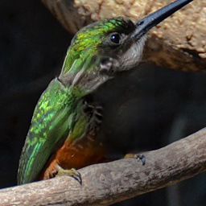

# generative-inpainting-pytorch
A PyTorch reimplementation for the paper [Generative Image Inpainting with Contextual Attention](https://arxiv.org/abs/1801.07892) according to the author's [TensorFlow implementation](https://github.com/JiahuiYu/generative_inpainting).

## Prerequisites
This code has been tested on Ubuntu 14.04 and the following are the main components that need to be installed:
- Python3
- PyTorch 1.0.0
- torchvision 0.2.0
- tensorboardX
- pyyaml

## Train the model
```bash
python train.py --config configs/config.yaml
```

The checkpoints and logs will be saved to `checkpoints`。

## Test with the trained model
By default, it will load the latest saved model in the checkpoints. You can also use `--iter` to choose the saved models by iteration.

Trained PyTorch model: ~~[[Google Drive](https://drive.google.com/drive/folders/1FHlDG94O8sH-sOOpkJBQmxCTicr1gc-C?usp=sharing)] [[Baidu Wangpan](https://pan.baidu.com/s/1c2xWhBIfyz0zttHP6lVR6w)]~~

(Note: The PyTorch model was trained on a bug version whose some channel numbers are wrong. To load the model, you need
to change the channel numbers according to [here](https://github.com/DAA233/generative-inpainting-pytorch/pull/2/commits/12f49c441edcdf585905f1758f6b5a2f14cb8d86#diff-584f4b3ab12058252e96596e3fd01fffL102).
The links will be updated after the model is trained from scratch again.)

```bash
python test_single.py \
	--image examples/imagenet/imagenet_patches_ILSVRC2012_val_00008210_input.png \
	--mask examples/center_mask_256.png \
	--output examples/output.png
```

## Test with the converted TF model:
Converted TF model: [[Google Drive](https://drive.google.com/file/d/1vz2Qp12_iwOiuvLWspLHrC1UIuhSLojx/view?usp=sharing)]

```bash
python test_tf_model.py \
	--image examples/imagenet/imagenet_patches_ILSVRC2012_val_00008210_input.png \
	--mask examples/center_mask_256.png \
	--output examples/output.png \
	--model-path torch_model.p
```

## Test results on ImageNet validation set patches

With PyTorch, the model was trained on ImageNet for 50k iterations to converge (about 120h). Here are some test results on the patches from ImageNet validation set.

| Input | Inpainted |
|:---:|:---:|
| [](examples/imagenet/imagenet_patches_ILSVRC2012_val_00000827_input.png)  | [](examples/imagenet/imagenet_patches_ILSVRC2012_val_00000827_output.png) |
| [](examples/imagenet/imagenet_patches_ILSVRC2012_val_00008210_input.png)  | [](examples/imagenet/imagenet_patches_ILSVRC2012_val_00008210_output.png) |
| [](examples/imagenet/imagenet_patches_ILSVRC2012_val_00022355_input.png)  | [](examples/imagenet/imagenet_patches_ILSVRC2012_val_00022355_output.png) |
| [](examples/imagenet/imagenet_patches_ILSVRC2012_val_00025892_input.png)  | [](examples/imagenet/imagenet_patches_ILSVRC2012_val_00025892_output.png) |
| [](examples/imagenet/imagenet_patches_ILSVRC2012_val_00045643_input.png)  | [](examples/imagenet/imagenet_patches_ILSVRC2012_val_00045643_output.png) |
